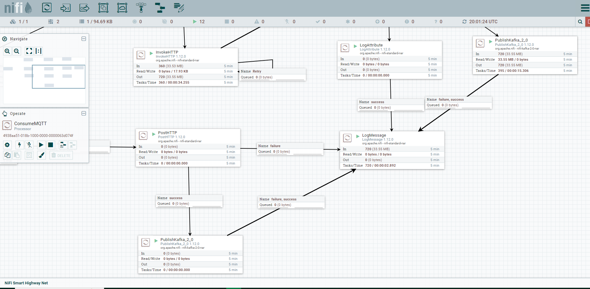

# 🚦 Traffic Sentinel - Driving Smarter Roads with IoT Traffic Monitoring 🌐

🚦 Traffic Sentinel drives the future of traffic monitoring with a scalable IoT-powered system. Seamlessly processing live feeds from IP cameras, this cutting-edge solution employs YOLO (You Only Look Once) for intelligent vehicle detection, offering real-time insights into dynamic traffic patterns on roads.

🔍 Leveraging the power of Fog nodes, Traffic Sentinel ensures swift intermediate processing, optimizing the flow of data. Apache Flink takes the wheel for efficient data processing, while Redis steps in for caching and seamless session management. The communication highway between nodes is orchestrated through the agile MQTT protocol, ensuring a synchronized and responsive traffic monitoring experience.

🌐 Unleash the potential of Traffic Sentinel as it transforms data streams into actionable intelligence, paving the way for smarter and safer roadways.

  
  
  
  
  
  
  
  
  
  
  
  
  

## Introduction

Traffic congestion and road safety are critical concerns in modern urban environments. Traffic Sentinel addresses these challenges by providing a comprehensive IoT-based traffic monitoring solution. The system collects video streams from IP cameras deployed on roads and uses machine learning techniques to detect and track vehicles in real time. This data is then processed and analyzed to provide insights into traffic flow, congestion, and potential safety issues.

## Services Foundation Layer
The Services Foundation Layer forms the bedrock of our system architecture, providing the essential infrastructure and core functionalities that support the entire ecosystem. This layer encompasses foundational components such as Kafka, Mosquitto, MongoDB, Vault, Redis, and other essential building blocks. It establishes the fundamental communication, data storage, security, and orchestration mechanisms that serve as the backbone for the entire solution. Services at this level handle critical tasks such as message queuing, data persistence, authentication, authorization, and secret management. The Services Foundation Layer ensures reliability, security, and scalability across the entire platform, serving as the base upon which subsequent layers are built.

## Framework-Extended Services Layer
The Framework-Extended Services Layer builds upon the strong foundation provided by the Services Foundation Layer. This layer extends the core capabilities by introducing specialized frameworks and advanced services that address specific application requirements. Apache Flink, a powerful real-time data processing framework, is a prime example of a component within this layer. Other services that enable complex stream processing, analytics, and data transformations also reside here. The Framework-Extended Services Layer adds a layer of sophistication to the system, offering advanced tools for analyzing, processing, and deriving insights from data streams. These services enrich the capabilities of the foundational layer, catering to intricate business needs and data processing scenarios.

## Fog Stream Processing Nodes Layer
The Fog Stream Processing Nodes Layer encapsulates the nodes within our edge computing architecture that specialize in real-time stream processing of data generated by IP cameras. These nodes are strategically positioned at the network's edge, close to the data sources, to minimize latency and optimize data processing efficiency. In this layer, the streaming data from IP cameras is ingested, analyzed, and transformed in real time to extract valuable insights. These nodes play a pivotal role in ensuring rapid and efficient data processing, enabling immediate responses to changing conditions or events captured by the cameras. By processing the streams at the edge, the Fog Stream Processing Nodes Layer enhances the overall system's performance, responsiveness, and ability to make data-driven decisions in time-critical scenarios.

## Architecture Overview

Traffic Sentinel's architecture is designed to handle the complexities of real-time traffic data processing. It consists of the following key components:

- **Fog Nodes**: Intermediate processing nodes placed strategically to preprocess data from IP cameras, reducing the load on central servers.
- **Apache Flink**: A stream processing framework used for real-time data analysis, enabling tasks like vehicle detection using YOLO.
- **Redis**: A caching and session management tool used for storing temporary data, such as authentication sessions.
- **MQTT**: A lightweight messaging protocol used for communication between Fog nodes and central servers.

## Technologies Used

- **Python**: The main programming language used for developing various components of the system.
- **Flask**: A lightweight web framework used for building the provisioning service that provides camera information to Fog nodes.
- **MongoDB**: A NoSQL database used for storing camera information associated with MAC addresses of Fog nodes.
- **Redis**: An in-memory data store used for caching and session management.
- **Apache Flink**: A stream processing framework for real-time data analysis.
- **YOLO (You Only Look Once)**: A deep learning-based object detection model used for vehicle detection in video streams.
- **MQTT**: A lightweight messaging protocol for communication between Fog nodes and central servers.

## Components

The Traffic Sentinel system comprises the following components:

- **Fog Node**: Responsible for intermediate data processing and communication with IP cameras, Apache Flink, and central servers.
- **Provisioning Service**: A Flask-based web service that provides camera information to Fog nodes based on MAC addresses.
- **Apache Flink Jobs**: Real-time data processing tasks for vehicle detection using the YOLO model.
- **Redis Cache**: Used for caching authentication sessions and other temporary data.
- **MongoDB Database**: Stores camera information associated with MAC addresses.

## Contributing

Contributions are welcome! If you'd like to contribute to Traffic Sentinel, please follow the guidelines in [CONTRIBUTING.md](CONTRIBUTING.md).

## License

This project is licensed under the [MIT License](LICENSE).

---

## Credits

Traffic Sentinel is developed and maintained by Sergio Sánchez Sánchez. Special thanks to the open-source community and the contributors who have made this project possible.

---

