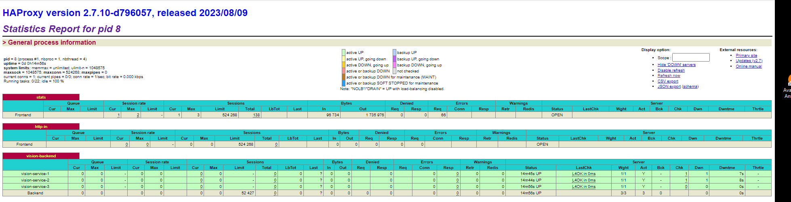
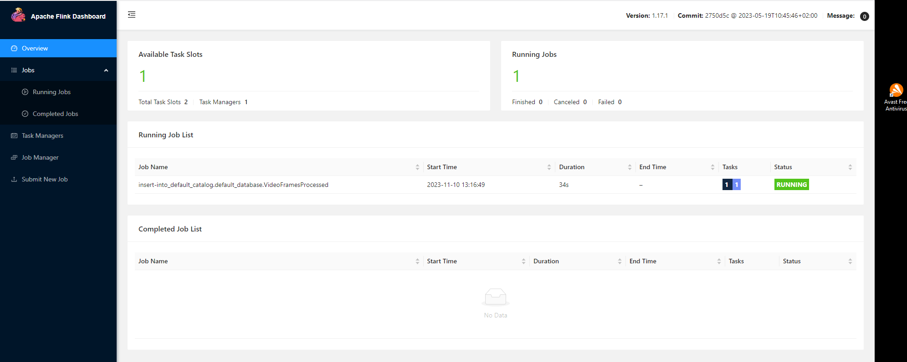
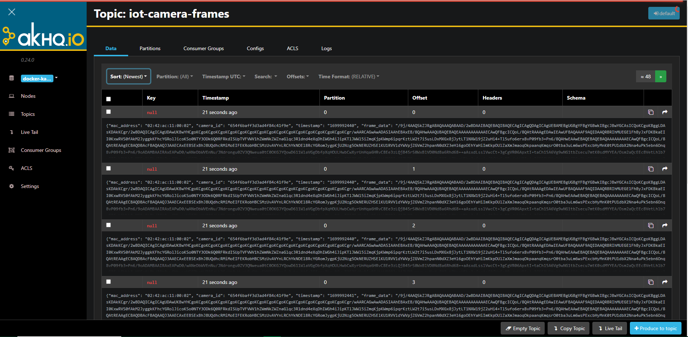

# 🚦 Traffic Sentinel - Driving Smarter Roads with IoT Traffic Monitoring 🌐

🚦 Traffic Sentinel drives the future of traffic monitoring with a scalable IoT-powered system. Seamlessly processing live feeds from IP cameras, this cutting-edge solution employs YOLO (You Only Look Once) for intelligent vehicle detection, offering real-time insights into dynamic traffic patterns on roads.

🔍 Leveraging the power of Fog nodes, Traffic Sentinel ensures swift intermediate processing, optimizing the flow of data. Apache Flink takes the wheel for efficient data processing, while Redis steps in for caching and seamless session management. The communication highway between nodes is orchestrated through the agile MQTT protocol, ensuring a synchronized and responsive traffic monitoring experience.

🌐 Unleash the potential of Traffic Sentinel as it transforms data streams into actionable intelligence, paving the way for smarter and safer roadways.

  
  
  
  
  
  
  
  
  
  
  
  
  
  
  

## Key Features 🚀

- **Real-Time Vehicle Detection and Tracking 🚗🔍**: Traffic Sentinel employs advanced machine learning models like YOLO (You Only Look Once) to detect and track vehicles in real-time video streams. It provides instantaneous and continuous tracking of vehicles on roads monitored by the IoT system.
- **Vehicle Speed Monitoring 🌐⚡**: The system performs specific speed analysis to determine which vehicles exceed the set speed limits on the roads monitored by the IoT. This allows identification and logging of vehicles that violate speed limits, contributing to improved road safety.
- **Efficient Data Processing with Apache Flink ⚙️💻**: Using Apache Flink for real-time data processing, Traffic Sentinel captures details like vehicle speed, enabling rapid identification of those exceeding limits. This functionality is crucial for taking immediate actions in speed violation situations.
- **Data Movement Orchestration with Apache NiFi 🔄🌩️**: The data orchestration layer, based on Apache NiFi, facilitates data flow between different components of the IoT system. It enables seamless integration between MQTT, Kafka, and other elements, optimizing analysis and detection of vehicles violating speed limits.
- **Robust and Secure Data Storage 💾🔐**: Traffic Sentinel utilizes MongoDB and Redis for storing processed data and managing information related to vehicles and users. Additionally, Vault by HashiCorp ensures secure management of credentials and sensitive data.
- **Flask Services for Management and Authentication 🛠️🔑**: Flask-based services ease user authentication and camera management, enhancing security and controlled access to the IoT system for vehicle and speed monitoring purposes.

## 🌐 Architecture Overview

Traffic congestion and road safety are critical concerns in modern urban environments. Traffic Sentinel addresses these challenges by providing a comprehensive IoT-based traffic monitoring solution. The system collects video streams from IP cameras deployed on roads and uses machine learning techniques to detect and track vehicles in real time. This data is then processed and analyzed to provide insights into traffic flow, congestion, and potential safety issues.

Traffic Sentinel consists of several layers, each playing a crucial role in the platform's architecture:

### 🌩️ Fog Stream Processing Layer

Responsible for ingesting frames from IoT cameras, this layer acts as an intermediary between IoT devices and the cloud. It utilizes MQTT for transmitting information, ensuring efficient data flow.

### 🔄 Data Orchestration Layer with Apache NiFi

The Data Orchestration Layer, powered by Apache NiFi, orchestrates data movement on a large scale. It integrates MQTT with Kafka, facilitating seamless data transfer across different components of the architecture.

### ⚙️ Real-time Processing with Apache Flink

The real-time processing layer, built on Apache Flink, performs live analysis of frames ingested into Kafka. It identifies vehicles present in frames, capturing details such as speed, model, color, and direction using the VehicleDetectionTracker module.

[VehicleDetectionTracker Repository](https://github.com/sergio11/vehicle_detection_tracker)

### 💾 Data Storage Layer

MongoDB serves as the repository for consolidated processed frames, managed IoT cameras, provisioned Fog nodes, and platform user data. Redis is used for session validation and other essential operations.

Vault by HashiCorp securely stores secrets, providing fine-grained control over sensitive data, including Fog node passwords required for resolving CHAP challenges.

### 🛠️ Data Services Layer with Flask

This layer houses multiple Flask services offering diverse functionalities:

- **Authentication and Provisioning Service for Fog Nodes:** Ensures secure access and authorization for Fog nodes.
- **User Authentication and Management:** Manages user authentication and access control.
- **Camera Management:** Allows configuration and monitoring of IoT cameras.
- **Processed Frame Streaming Service:** Enables the streaming of processed frames to authorized users.

## Technologies Used

- **Python** 🐍:  Main programming language used for system development. Python's versatility and extensive libraries facilitate rapid development across different layers of the platform.
- **Flask** 🌐: Lightweight web framework for building the provisioning service that provides camera information to Fog nodes. Facilitates seamless communication between components.
- **MongoDB** 📁: NoSQL database for storing camera information associated with Fog nodes' MAC addresses. Ensures efficient and scalable management of diverse camera data.
- **Redis** 🔄: In-memory data store for caching and session management. Improves performance by caching frequently accessed data and maintaining session information.
- **Apache Flink** 🚀: Stream processing framework for real-time data analysis. Enables real-time analysis of video streams, aiding in efficient data processing.
- **YOLO (You Only Look Once)** 👁️: Deep learning-based object detection model used for vehicle detection in video streams. Provides high accuracy in real-time vehicle detection.
- **MQTT (Message Queuing Telemetry Transport)** 📡: Lightweight messaging protocol for Fog nodes and central servers. Enables efficient communication crucial for real-time traffic monitoring.
- **Apache NiFi 🔄🌩️:** An integral part of the Data Orchestration Layer, orchestrates data movement at scale. Integrates MQTT with Kafka for seamless data transfer across different components.
- **Tkinter 🖼️:** Python's de-facto standard GUI (Graphical User Interface) package for building user interfaces.
- **ZooKeeper 🦁:** A centralized service used for maintaining configuration information, naming, providing distributed synchronization, and group services.
- **Socket.IO 🌐:** A library that enables real-time, bidirectional, and event-based communication between web clients and servers, used for transmitting real-time updates in the application.
- **Vault by HashiCorp 🔒:** A tool for managing secrets and protecting sensitive data. Used for secure storage of secrets, such as Fog node passwords required for resolving CHAP challenges.
- **Ruby Rake 💎:** Utilized for administrative tasks and project setup, offering robustness in configuration management and automation.
- **Docker 🐳:** Containerization platform used for packaging applications and their dependencies into containers to ensure consistency in various environments.
- **MinIO 📦:** An object storage server compatible with Amazon S3 API used for storing images and files in a scalable and high-performance manner.
- **HAproxy 🔄:** An open-source load balancer used for improving the availability and reliability of the platform, ensuring smooth traffic management and distribution.

### Screenshots 📷

Here are some screenshots that demonstrate the functionality of Traffic Sentinel:

| Screenshot 1 | Screenshot 2 |
|-------------- |-------------- |
|  |  |

| Screenshot 1 | Screenshot 2 |
|-------------- |-------------- |
|  |  |

| Screenshot 1 | Screenshot 2 |
|-------------- |-------------- |
|  |  |

| Screenshot 1 | Screenshot 2 |
|-------------- |-------------- |
|  |  |

| Screenshot 1 | Screenshot 2 |
|-------------- |-------------- |
|  |  |

| Screenshot 1 | Screenshot 2 |
|-------------- |-------------- |
|  |  |

| Screenshot 1 | Screenshot 2 |
|-------------- |-------------- |
|  |  |

| Screenshot 1 | Screenshot 2 |
|-------------- |-------------- |
|  |  |

## Tools screenshots

In this section some details of the components that make the project possible will be shown and explained.

### HAProxy

HAProxy plays a pivotal role within the Traffic Sentinel architecture as a load balancer, primarily responsible for distributing incoming traffic evenly across multiple servers, applications, or nodes. This ensures the availability, reliability, and efficiency of the system.

In the context of Traffic Sentinel, HAProxy functions as a key traffic manager, directing incoming client requests to various components of the distributed system. For instance, it routes requests to different Flask services, MongoDB, Redis, Apache Flink, among others. This guarantees that each request is handled fairly and efficiently, preventing overload on any specific server or service and maintaining high overall system availability.

Beyond load balancing, HAProxy serves as a central point for traffic monitoring and control. It conducts health checks on nodes or services to ensure their proper functioning before redirecting traffic. Additionally, it implements advanced routing rules and filtering to optimize data flow and security, safeguarding the system against potential attacks or network issues.

In summary, within Traffic Sentinel, HAProxy provides a robust mechanism for efficiently distributing and managing network traffic, ensuring smooth and reliable operation of the system. It enhances scalability and availability of services offered by the traffic monitoring platform.

### Apache Flink

Apache Flink serves as a pivotal component for real-time data processing. This open-source framework specializes in distributed, scalable data stream processing. Within Traffic Sentinel, Flink is utilized to analyze and process data from traffic cameras and other connected IoT devices in real-time.

The primary purpose of Apache Flink in this project is to efficiently manage the ingestion of data from various sources. It processes high-speed data streams and performs operations like transformation, filtering, enrichment, and aggregation in real-time. This capability allows Traffic Sentinel to conduct instantaneous analysis and make real-time decisions based on the collected data.

Flink offers advanced real-time data processing capabilities that empower Traffic Sentinel to detect patterns, trends, and anomalies in traffic. This is crucial for continuous monitoring of traffic congestion, identification of vehicles exceeding speed limits, and detection of irregular behaviors on roads. Real-time data processing is fundamental in enhancing road safety and traffic flow efficiency.

Furthermore, Apache Flink is highly scalable and fault-tolerant. It efficiently handles large volumes of data and maintains system reliability even under high-stress situations. This scalability ensures Traffic Sentinel's optimal performance as the volume of data and connected IoT devices continues to grow.

### Apache Nifi

Apache NiFi plays a fundamental role in the Traffic Sentinel project as a data orchestration and integration tool. It operates as the data movement engine, facilitating the flow and management of data across different components of the IoT-based traffic monitoring system.

The primary purpose of Apache NiFi within Traffic Sentinel is to orchestrate the movement of data between various sources, processing layers, and storage systems. It provides a visual interface for designing data flows, enabling users to create, monitor, and manage complex data pipelines easily.

NiFi's data flow capabilities are integral in handling diverse data sources and formats, allowing Traffic Sentinel to collect real-time traffic data from IoT devices, such as traffic cameras and sensors, and efficiently route it for further processing and analysis.

Moreover, Apache NiFi enhances the system's efficiency by integrating with different data transfer protocols, including MQTT and Kafka, ensuring seamless communication and data transfer between components. It optimizes the integration between Fog nodes, data processing layers, and storage systems, thereby streamlining the traffic monitoring process.

Overall, Apache NiFi serves as a crucial component in the Traffic Sentinel architecture, providing a scalable, efficient, and user-friendly platform for orchestrating data movement, transforming, routing, and optimizing the flow of information within the IoT-based traffic monitoring system.

### Apache Kafka

Kafka, in the context of Traffic Sentinel, operates as a distributed streaming platform, providing a highly scalable and fault-tolerant infrastructure for handling real-time data streams. It serves as a central nervous system for the IoT-based traffic monitoring system, enabling reliable and high-throughput data ingestion, storage, and real-time processing of traffic-related information.

Kafka acts as a messaging backbone, facilitating the exchange of data between different components of the Traffic Sentinel architecture. It enables the ingestion of live video streams, sensor data, and other traffic-related information from various sources, including IoT devices like cameras, into the system. Kafka's distributed nature and fault-tolerant design ensure the durability and reliability of data during transit, making it suitable for handling large volumes of streaming data.

Moreover, the integration of AkHQ.io, a graphical user interface (GUI) for managing and monitoring Apache Kafka, enhances the observability and management capabilities of the Kafka infrastructure within Traffic Sentinel. AkHQ.io provides a user-friendly interface for monitoring Kafka clusters, topics, and brokers, allowing administrators and developers to visualize Kafka-related metrics, monitor consumer lag, manage topics, and perform administrative tasks efficiently.

By combining Kafka as the streaming platform and AkHQ.io as the visualization and management tool, Traffic Sentinel benefits from a robust and scalable architecture for handling real-time traffic data. Kafka ensures reliable data streaming and processing, while AkHQ.io offers comprehensive monitoring and management features, empowering users to effectively oversee and optimize the Kafka infrastructure powering the traffic monitoring system.

### MongoDB

MongoDB serves as the primary database solution in the project for storing and managing large volumes of unstructured or semi-structured data efficiently. It operates as a NoSQL database, which excels in handling diverse and rapidly changing data formats commonly found in modern applications. MongoDB's schema-less architecture allows for flexible data modeling, enabling the storage of various types of data without requiring a predefined schema. This feature proves valuable when dealing with dynamic data from IoT devices, as it accommodates evolving data structures without compromising performance.

Furthermore, MongoDB's distributed nature and horizontal scalability offer the capability to handle considerable data growth and high throughput, crucial for managing real-time data streams generated by IoT devices. Its sharding and replication features facilitate load distribution and ensure high availability, supporting the system's resilience and fault tolerance. This database choice aligns well with the project's objectives of managing vast amounts of data generated by IoT sensors, allowing for seamless data storage, retrieval, and scalability while accommodating changes in the data model over time.

### Flask Services

The Flask services within the data services layer play a pivotal role in mediating interactions between the application's frontend and the MongoDB database. These services serve as a bridge, offering a set of endpoints that facilitate Create, Read, Update, and Delete (CRUD) operations on the database. They handle data requests, processing incoming HTTP requests from the frontend, and executing corresponding actions on the database, ensuring seamless data access.

One primary purpose of these Flask services is to encapsulate the business logic associated with data management. They implement specific rules, validations, and transformations required before storing or retrieving data from MongoDB. These services enable developers to centralize and organize intricate data-handling operations, ensuring data consistency, integrity, and adherence to defined business rules or constraints.

Furthermore, these Flask services provide secure access to the database. They manage authentication, authorization, and data validation, verifying the legitimacy of incoming requests, authorizing access based on user permissions, and enforcing security measures to protect sensitive data. This layer ensures that only authorized entities can access, modify, or delete specific data within the MongoDB database, safeguarding against potential security threats and unauthorized access.

## Rake Tasks

This project leverages Rake to manage various tasks related to infrastructure and data management. Below is a table listing some of the available Rake tasks along with their respective descriptions. These tasks are pivotal for configuring, managing, and maintaining different aspects of the SmartHighwayNet system.

Please refer to the project documentation for more details on how to execute each task and their purposes within the project's workflow.

| Task | Description |
|------|-------------|
| `SmartHighwayNet:login` | Authenticating with existing credentials. |
| `SmartHighwayNet:cleaning_environment_task` | Cleaning Environment. |
| `SmartHighwayNet:status` | Show Containers Status. |
| `SmartHighwayNet:check_docker_task` | Check Docker and Docker Compose. |
| `SmartHighwayNet:DataStorageLayer:check_deployment_file` | Check data storage layer deployment file. |
| `SmartHighwayNet:DataStorageLayer:start` | Start data storage layer containers. |
| `SmartHighwayNet:DataStorageLayer:stop` | Stop data storage layer container. |
| `SmartHighwayNet:DataStorageLayer:deploy` | Deploy data storage layer container. |
| `SmartHighwayNet:DataStorageLayer:initialize_and_unseal` | Initialize and Unseal Vault instance. |
| `SmartHighwayNet:DataStorageLayer:seal` | Seal Vault instance. |
| `SmartHighwayNet:DataStorageLayer:enable_secrets` | Enable secrets within a Vault instance. |
| `SmartHighwayNet:DataStorageLayer:preload_fog_nodes` | Preload fog node configurations into Vault. |
| `SmartHighwayNet:DataStorageLayer:retrieve_fog_nodes` | Retrieve fog node information securely stored in Vault. |
| `SmartHighwayNet:DataStorageLayer:empty_vault` | Delete all secrets from the Vault. |
| `SmartHighwayNet:DataStorageLayer:configure` | Configure Service Foundation layer by initializing, enabling secrets, and preloading tasks. |
| `SmartHighwayNet:DataOrchestrationLayer:check_deployment_file` | Check data orchestration layer deployment file. |
| `SmartHighwayNet:DataOrchestrationLayer:start` |	Start data orchestration layer containers. |
| `SmartHighwayNet:DataOrchestrationLayer:stop` |	Stop data orchestration layer container. |
| `SmartHighwayNet:DataOrchestrationLayer:deploy` |	Deploy data orchestration layer container. |
| `SmartHighwayNet:ManagementAndMonitoringLayer:check_deployment_file` |	Check management and monitoring layer deployment file. |
| `SmartHighwayNet:ManagementAndMonitoringLayer:start` |	Start management and monitoring layer containers. |
| `SmartHighwayNet:ManagementAndMonitoringLayer:stop` |	Stop management and monitoring layer container. |
| `SmartHighwayNet:ManagementAndMonitoringLayer:deploy` |	Deploy management and monitoring layer container. |
| `SmartHighwayNet:ManagementAndMonitoringLayer:launch_monitoring_client` |	Launch Tkinter client for management and monitoring. |
| `SmartHighwayNet:RealTimeDataProcessingLayer:build` |	Build stream processing layer. |
| `SmartHighwayNet:RealTimeDataProcessingLayer:check_deployment_file` |	Check stream processing layer deployment file. |
| `SmartHighwayNet:RealTimeDataProcessingLayer:start` |	Start stream processing layer containers. |
| `SmartHighwayNet:RealTimeDataProcessingLayer:stop` |	Stop stream processing layer container. |
| `SmartHighwayNet:RealTimeDataProcessingLayer:deploy` |	Deploy stream processing layer container. |
| `SmartHighwayNet:RealTimeDataProcessingLayer:install_job` |	Install and run VideoFrameProcessorFlink. |
| `SmartHighwayNet:DataServicesLayer:build` |	Build data services layer. |
| `SmartHighwayNet:DataServicesLayer:check_admin_user` |	Check admin user status. |
| `SmartHighwayNet:DataServicesLayer:preload_cameras` |	Preload cameras. |
| `SmartHighwayNet:DataServicesLayer:preload_provisioning` |	Preload provisioning. |
| `SmartHighwayNet:DataServicesLayer:check_deployment_file` |	Check data services layer Deployment File. |
| `SmartHighwayNet:DataServicesLayer:start` |	Start data services layer containers. |
| `SmartHighwayNet:DataServicesLayer:stop` |	Stop data services layer container. |
| `SmartHighwayNet:DataServicesLayer:deploy` |	Deploy data services layer container. |
| `SmartHighwayNet:FogStreamingLayer:build` |	Build the Docker image for the Fog node. |
| `SmartHighwayNet:FogStreamingLayer:check_deployment_file` |	Check Fog streaming layer Deployment File. |
| `SmartHighwayNet:FogStreamingLayer:start` |	Start fog streaming layer containers. |
| `SmartHighwayNet:FogStreamingLayer:stop` |	Stop fog streaming layer container. |
| `SmartHighwayNet:FogStreamingLayer:deploy` |	Deploy fog streaming layer container. |

## 🤝 Contributing

We welcome contributions from the community. Feel free to open issues, suggest enhancements, or submit pull requests to help enhance Traffic Sentinel.

## 📝 License

This project is licensed under the [MIT License](LICENSE).

---

## Credits

Traffic Sentinel is developed and maintained by Sergio Sánchez Sánchez. Special thanks to the open-source community and the contributors who have made this project possible.

---

