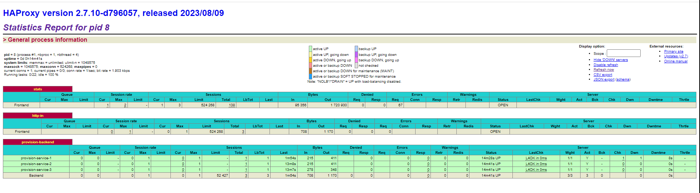

# 🚦 Traffic Sentinel - Driving Smarter Roads with IoT Traffic Monitoring 🌐

🚦 Traffic Sentinel drives the future of traffic monitoring with a scalable IoT-powered system. Seamlessly processing live feeds from IP cameras, this cutting-edge solution employs YOLO (You Only Look Once) for intelligent vehicle detection, offering real-time insights into dynamic traffic patterns on roads.

🔍 Leveraging the power of Fog nodes, Traffic Sentinel ensures swift intermediate processing, optimizing the flow of data. Apache Flink takes the wheel for efficient data processing, while Redis steps in for caching and seamless session management. The communication highway between nodes is orchestrated through the agile MQTT protocol, ensuring a synchronized and responsive traffic monitoring experience.

🌐 Unleash the potential of Traffic Sentinel as it transforms data streams into actionable intelligence, paving the way for smarter and safer roadways.

  
  
  
  
  
  
  
  
  
  
  
  
  
  

## Key Features 🚀

* **Real-Time Vehicle Detection and Tracking 🚗🔍**: Traffic Sentinel employs advanced machine learning models like YOLO (You Only Look Once) to detect and track vehicles in real-time video streams. It provides instantaneous and continuous tracking of vehicles on roads monitored by the IoT system.
* **Vehicle Speed Monitoring 🌐⚡**: The system performs specific speed analysis to determine which vehicles exceed the set speed limits on the roads monitored by the IoT. This allows identification and logging of vehicles that violate speed limits, contributing to improved road safety.
* **Efficient Data Processing with Apache Flink ⚙️💻**: Using Apache Flink for real-time data processing, Traffic Sentinel captures details like vehicle speed, enabling rapid identification of those exceeding limits. This functionality is crucial for taking immediate actions in speed violation situations.
* **Data Movement Orchestration with Apache NiFi 🔄🌩️**: The data orchestration layer, based on Apache NiFi, facilitates data flow between different components of the IoT system. It enables seamless integration between MQTT, Kafka, and other elements, optimizing analysis and detection of vehicles violating speed limits.
* **Robust and Secure Data Storage 💾🔐**: Traffic Sentinel utilizes MongoDB and Redis for storing processed data and managing information related to vehicles and users. Additionally, Vault by HashiCorp ensures secure management of credentials and sensitive data.
* **Flask Services for Management and Authentication 🛠️🔑**: Flask-based services ease user authentication and camera management, enhancing security and controlled access to the IoT system for vehicle and speed monitoring purposes.

## 🌐 Architecture Overview

Traffic congestion and road safety are critical concerns in modern urban environments. Traffic Sentinel addresses these challenges by providing a comprehensive IoT-based traffic monitoring solution. The system collects video streams from IP cameras deployed on roads and uses machine learning techniques to detect and track vehicles in real time. This data is then processed and analyzed to provide insights into traffic flow, congestion, and potential safety issues.

Traffic Sentinel consists of several layers, each playing a crucial role in the platform's architecture:

### 🌩️ Fog Stream Processing Layer

Responsible for ingesting frames from IoT cameras, this layer acts as an intermediary between IoT devices and the cloud. It utilizes MQTT for transmitting information, ensuring efficient data flow.

### 🔄 Data Orchestration Layer with Apache NiFi

The Data Orchestration Layer, powered by Apache NiFi, orchestrates data movement on a large scale. It integrates MQTT with Kafka, facilitating seamless data transfer across different components of the architecture.

### ⚙️ Real-time Processing with Apache Flink

The real-time processing layer, built on Apache Flink, performs live analysis of frames ingested into Kafka. It identifies vehicles present in frames, capturing details such as speed, model, color, and direction using the VehicleDetectionTracker module.

[VehicleDetectionTracker Repository](https://github.com/sergio11/vehicle_detection_tracker)

### 💾 Data Storage Layer

MongoDB serves as the repository for consolidated processed frames, managed IoT cameras, provisioned Fog nodes, and platform user data. Redis is used for session validation and other essential operations.

Vault by HashiCorp securely stores secrets, providing fine-grained control over sensitive data, including Fog node passwords required for resolving CHAP challenges.

### 🛠️ Data Services Layer with Flask

This layer houses multiple Flask services offering diverse functionalities:

- **Authentication and Provisioning Service for Fog Nodes:** Ensures secure access and authorization for Fog nodes.
- **User Authentication and Management:** Manages user authentication and access control.
- **Camera Management:** Allows configuration and monitoring of IoT cameras.
- **Processed Frame Streaming Service:** Enables the streaming of processed frames to authorized users.

## Technologies Used

- **Python** 🐍:  Main programming language used for system development. Python's versatility and extensive libraries facilitate rapid development across different layers of the platform.

- **Flask** 🌐: Lightweight web framework for building the provisioning service that provides camera information to Fog nodes. Facilitates seamless communication between components.

- **MongoDB** 📁: NoSQL database for storing camera information associated with Fog nodes' MAC addresses. Ensures efficient and scalable management of diverse camera data.

- **Redis** 🔄: In-memory data store for caching and session management. Improves performance by caching frequently accessed data and maintaining session information.

- **Apache Flink** 🚀: Stream processing framework for real-time data analysis. Enables real-time analysis of video streams, aiding in efficient data processing.

- **YOLO (You Only Look Once)** 👁️: Deep learning-based object detection model used for vehicle detection in video streams. Provides high accuracy in real-time vehicle detection.

- **MQTT (Message Queuing Telemetry Transport)** 📡: Lightweight messaging protocol for Fog nodes and central servers. Enables efficient communication crucial for real-time traffic monitoring.

## 🚀 Getting Started

To begin using Traffic Sentinel, follow these steps:

1. Clone the Traffic Sentinel repository.
2. Install the required dependencies using the provided instructions.
3. Configure each layer and service according to the setup guide.
4. Run the platform using the designated start commands for each component.

## 🤝 Contributing

We welcome contributions from the community. Feel free to open issues, suggest enhancements, or submit pull requests to help enhance Traffic Sentinel.

## 📝 License

This project is licensed under the [MIT License](LICENSE).

## Components

The Traffic Sentinel system comprises the following components:

- **Fog Node**: Responsible for intermediate data processing and communication with IP cameras, Apache Flink, and central servers.
- **Provisioning Service**: A Flask-based web service that provides camera information to Fog nodes based on MAC addresses.
- **Apache Flink Jobs**: Real-time data processing tasks for vehicle detection using the YOLO model.
- **Redis Cache**: Used for caching authentication sessions and other temporary data.
- **MongoDB Database**: Stores camera information associated with MAC addresses.

## Contributing

Contributions are welcome! If you'd like to contribute to Traffic Sentinel, please follow the guidelines in [CONTRIBUTING.md](CONTRIBUTING.md).

## License

This project is licensed under the [MIT License](LICENSE).

---

## Credits

Traffic Sentinel is developed and maintained by Sergio Sánchez Sánchez. Special thanks to the open-source community and the contributors who have made this project possible.

---

